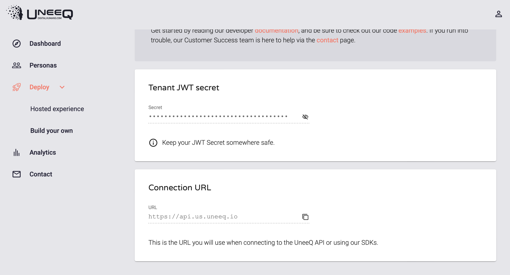
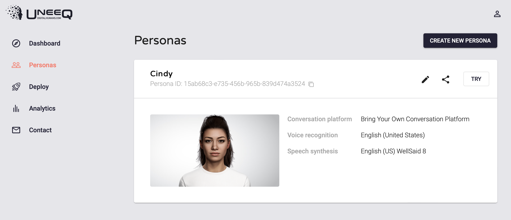
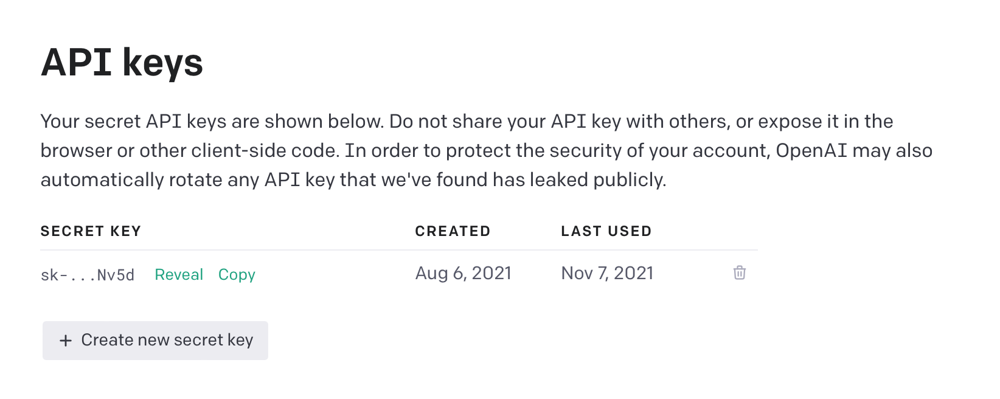
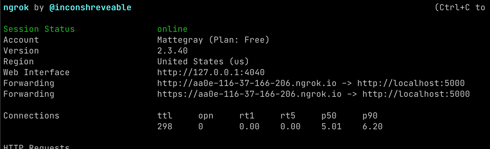
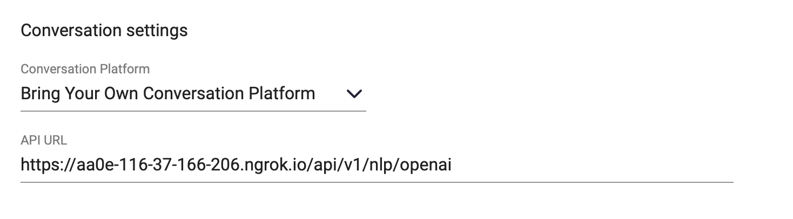

# GrapeSEED AI

The COVID-19 pandemic has led to the sudden rise of online learning, where teaching and learning are done remotely, mostly via platforms such as Zoom, Google Meet, or Cisco Webex. At the same time, it is getting more and more difficult to hire English teachers. This got us thinking, will it be possible to use artificial intelligence to replace some basic roles provided by real-life English teachers?

## Technologies used

This project explores whether AI could be used for English education for children. Specifically, we explore whether AI can have a basic face-to-face conversation with the students, give lessons, and assess students' participation and pronunciation. To make this possible, it uses three main technologies:

- [UneeQ Digital Human](https://digitalhumans.com)

  It provides a digital avatar. It comes with documentation, SDK, and example applications to make it easy for anyone to integrate any third-party conversation platform.

- [OpenAI GPT-3](https://beta.openai.com)

  It is a pre-trained language model, trained on the corpus of text with more than 175 billion parameters. It can generate anything that has a language structure.

- [ETRI Pronunciation Assessment](https://aiopen.etri.re.kr)

  Created by the Electronics and Telecommunications Research Institute in South Korea, it provides pronunciation assessment through their REST endpoint.


## What it does (can do)

The application is currently programmed to follow a [GrapeSEED](https://grapeseed.com/us/) English lesson plan (Unit 10 Lesson 1). It combines the following:

- Prerecorded lesson videos
- Asks questions about the lesson content
- Pronunciation assessment
- Basic open-ended conversation

## Project structure

The project is built on top of [this](https://gitlab.com/uneeq-oss/examples/tree/master) example repository. It consists of three microservices:

- **Token**

  The purpose of this application is to return a single-use token as generated by the UneeQ API server, using a private token that is secret to this application. By generating tokens in this way, customer secrets can be kept securely within this application and not exposed via an HTML front-end application. - [Node JS](https://github.com/Mattegray/grapeseed-ai/tree/main/token/node)

- **Web Front End**

  [HTML / Javascript](https://github.com/Mattegray/grapeseed-ai/tree/main/web/node)

- **Conversation Platform API**

  This application implements conversation platform integration with a UneeQ digital human. The application can be configured to connect a UneeQ digital human to Dialogflow, Dialogflow CX, Watson, Lex, Wolfram Alpha, and Directline concurrently. For the purposes of this project, it is configured to connect to OpenAI API. - [Node JS](https://github.com/Mattegray/grapeseed-ai/tree/main/conversation/node)


Most of the development is done in the **Web Front End** and **Conversation Platform API**, specifically in the directory `grapeseed-ai/conversation/node/services/nlp/openai/`

## How to Use

### Prerequisites

- UneeQ User Account

  You can start with the free trial [here](https://digitalhumans.com/contact/start-a-free-trial/).

- OpenAI API Key

  You have to join the private beta [here](https://beta.openai.com).

- ETRI API Key

  You can request the key [here](https://aiopen.etri.re.kr/key_main.php).


### Installation

Clone the repository to your desired directory:

```bash
git clone https://github.com/Mattegray/grapeseed-ai.git
```

### Configure environment

Now, you need to provide the necessary environment variables.

Create a new `.env` file in the directory `/grapeseed-ai/token/node` and add the following:

```bash
UNEEQ_URI=https://uneeq-server-here
UNEEQ_SECRET=uneeq-secret-here
UNEEQ_WORKSPACE=uneeq-workspace-here
```

`UNEEQ_URI` and `UNEEQ_SECRET` can be found [here](https://creator.uneeq.io/deploy/build-your-own):



`UNEEQ_WORKSPACE` is generated after you create a persona:



Go to `/grapeseed-ai/web/node/main.js` and assign the same values to the following variables:

```bash
UNEEQ_URL=https://uneeq-server-here
UNEEQ_WORKSPACE=uneeq-workspace-here
```

Now create a new `.env` file in the directory `/grapeseed-ai/conversation/node` and add the following:

```bash
# OpenAI configuration
API_ROUTE_NLP_OPENAI=/openai
OPENAI_ENABLED=true
OPENAI_API_KEY=openai-api-key-here

API_ROUTE_NLP_STEM=/nlp
API_ROUTE=/api/v1
LOG_LEVEL=info
```

`OPENAI_API_KEY` can be found [here](https://beta.openai.com/account/api-keys):



### Install dependencies

Go to `/grapeseed-ai/token/node` and run `npm install`

Go to `/grapeseed-ai/web/node` and run `npm install`

Go to `/grapeseed-ai/conversation/node` and run `npm install`

### Deploy (locally)

I recommend using [NGROK](https://ngrok.com/download) to run the application locally.

In the directory where NGROK is installed, run `./ngrok http 5000`



Copy the generated public address. In the image above it is `https://aa0e-116-37-166-206.ngrok.io`

In the UneeQ persona [settings](https://creator.uneeq.io/personas), provide the public address + `/api/v1/nlp/openai` as a parameter to "Bring your own Conversation" option:



### Run the application

Go to `/grapeseed-ai/token/node` and run `npm start`

Go to `/grapeseed-ai/web/node` and run `npm start`

Go to `/grapeseed-ai/conversation/node` and run `npm start`

The application is ready at localhost:8080.

## Notes

For copyright reasons, the `/grapeseed-ai/web/node/assets` directory is not included. If you would like to get the files, please contact me at hyungwoo_128@outlook.com.